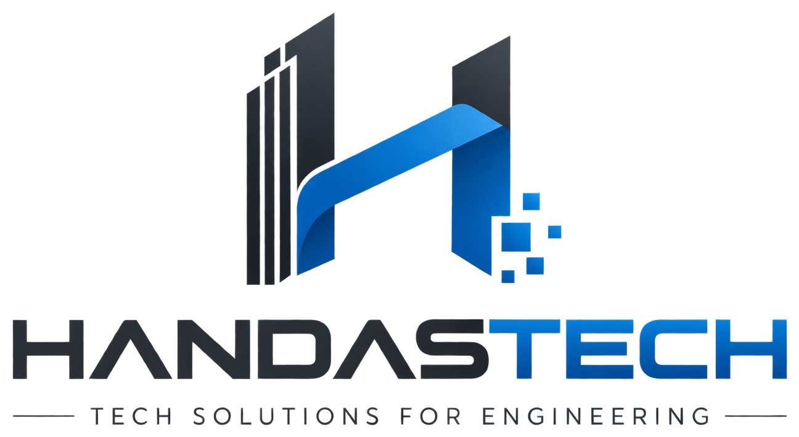

# Handastech LMS (منصة هندسة تك)

<p align="center">
  
</p>

<p align="center">
  <strong>Tech Solutions for Engineering | حلول تقنية وتدريب هندسي احترافي</strong>
</p>

<p align="center">
  <a href="LICENSE"></a>
  <a href="https://frappeframework.com/"></a>
  <a href="https://docker.com"></a>
  
</p>

---

## 🏗️ Project Overview (نظرة عامة)

**Handastech LMS** is an enterprise-grade specialized learning management and technical training platform tailored for the civil engineering industry in Saudi Arabia and the GCC region. Built upon **Frappe Framework v15** and **Frappe LMS**, extended with the custom app `builders`, the platform provides:

- 🏛️ **Comprehensive Engineering Taxonomy**: 5 core departments (Structural Engineering, Construction Management, Codes & Standards SBC, Software Modeling ETABS/SAFE, and Quantity Surveying).
- 🌐 **Arabic-First Localization**: Native Right-to-Left (RTL) experience with dynamic English/Arabic switching.
- 🎨 **Modern Tech Branding**: Handastech identity featuring Architectural Slate Charcoal (`#1E2530`) and Vibrant Tech Blue (`#0066CC`).
- 🔐 **Zero-Cost Anti-Piracy Video Protection**: Transcoding via FFmpeg HLS AES-128, Frappe token-gated key delivery, memory-blob playback, and dynamic forensic watermarking with DOM tamper-proofing.
- ⚡ **Production Architecture**: Multi-container Docker deployment with MariaDB 10.8, Redis Cache, Redis Queue, Frappe Bench, and Nginx reverse proxy with SSL automation.

---

## 📂 Directory Layout (هيكل المشروع)

```text
Handastech LMS/
├── builders/               # تطبيق المنصة المخصص (الأقسام الهندسية، الهوية، واجهات API)
│   ├── builders/           # Python modules, hooks, custom utilities
│   │   ├── fixtures/       # بيانات تصنيفات الدورات الهندسية
│   │   ├── public/         # الخطوط العربية، شعارات Handastech، أنماط RTL
│   │   │   └── images/     # شعارات وأيقونات Handastech الرسمية
│   │   ├── utils.py        # واجهات Frappe Whitelisted APIs (الهوية، البريد، الحماية)
│   │   └── seed_curriculum.py # مولد المناهج والدروس الهندسية التفاعلية
│   └── setup.py            # ملف إعداد التطبيق
├── lms/                    # تطبيق Frappe LMS الأساسي المُعدل
│   ├── docker/             # سكربتات التهيئة وترقيعات الواجهة الذاتية
│   ├── frontend/           # واجهة SPA الحديثة (Vue 3 / Vite)
│   └── lms/                # نماذج الدورات والدروس والشهادات
├── nginx/                  # خادم Nginx العكسي وإعدادات الحماية والـ SSL
│   ├── conf.d/             # ضبط النطاقات وتحديد معدل الطلبات (Rate Limiting)
│   └── ssl/                # شهادات التشفير والتأمين
├── scripts/                # أدوات الصيانة والاختبار المؤتمت:
│   ├── test_all_screens.py # فحص الـ 36 شاشة ونقطة نهاية (100% نجاح)
│   ├── test_enrollment.py  # فحص عمليات التسجيل الفوري في الدورات
│   ├── configure_email.py  # معالج إعداد خوادم SMTP والبريد
│   └── seed_courses.py     # سكربت زراعة بيانات المناهج والدورات
├── docs/                   # التوثيق والعروض التقديمية:
│   └── presentation/       # العرض التقديمي التنفيذي وواجهات المعاينة التفاعلية
├── docker-compose.prod.yml # الأوركسترا لبيئة الإنتاج الكاملة
├── .env.production.example # قالب المتغيرات البيئية
├── deploy.sh               # سكربت النشر بنقرة واحدة
├── README.md               # التوثيق الشامل
└── .gitignore              # حماية الأسرار ومجلدات العمل المعزولة
```

---

## 🚀 Quick Start (التشغيل السريع)

```bash
# Clone the repository
git clone https://github.com/elkhayyat17/builders-lms.git
cd builders-lms

# Start the services
docker compose -f docker-compose.prod.yml up -d

# Verify services health
docker ps
```

The platform will be live at:
- **LMS Portal**: [http://localhost:8000/lms](http://localhost:8000/lms)
- **Frappe Desk**: [http://localhost:8000/app](http://localhost:8000/app)
- **Showcase / Presentation**: [http://localhost:3000](http://localhost:3000)

---

## 👥 Verified Test Accounts (حسابات الاختبار)

| الدور (Role) | البريد الإلكتروني (Email) | كلمة المرور (Password) | الصلاحيات والوصول |
|---|---|---|---|
| **Student** | `student@builders.sa` | `Student2026!` | تصفح الدورات، التسجيل الفوري، مشاهدة الدروس، حل الاختبارات |
| **Instructor** | `instructor@builders.sa` | `Instructor2026!` | إدارة محتوى الدورات الإنشائية، رفع الفيديوهات، متابعة الطلاب |
| **Manager** | `manager@builders.sa` | `Manager2026!` | لوحة تحكم Desk، تقارير الإيرادات، إدارة الاشتراكات، الصلاحيات |
| **Administrator** | `Administrator` | `admin` | الوصول الكامل للنظام وإعدادات السيرفر والمكتبات |

---

## 🧪 Automated Testing Suite (الاختبارات المؤتمتة)

```bash
# Run comprehensive 36-point test suite
python scripts/test_all_screens.py

# Verify live course enrollment
python scripts/test_enrollment.py
```

---

## 📄 License
This project is licensed under the MIT License.
